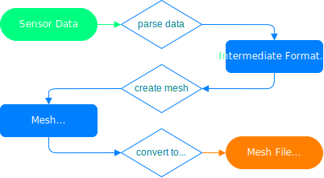

# Software Design
The following document describes the fundemental design of this python package.

## Data Pipeline
The package is essentially a data pipeline as shown in the following diagram.

As can be seen, data is inputed into the program in the form of one or more sensors outputs. Next the data is parsed and converted into an intermediate representation from which the program can create a mesh. Finally the mesh is converted to file format and written to an output file.
